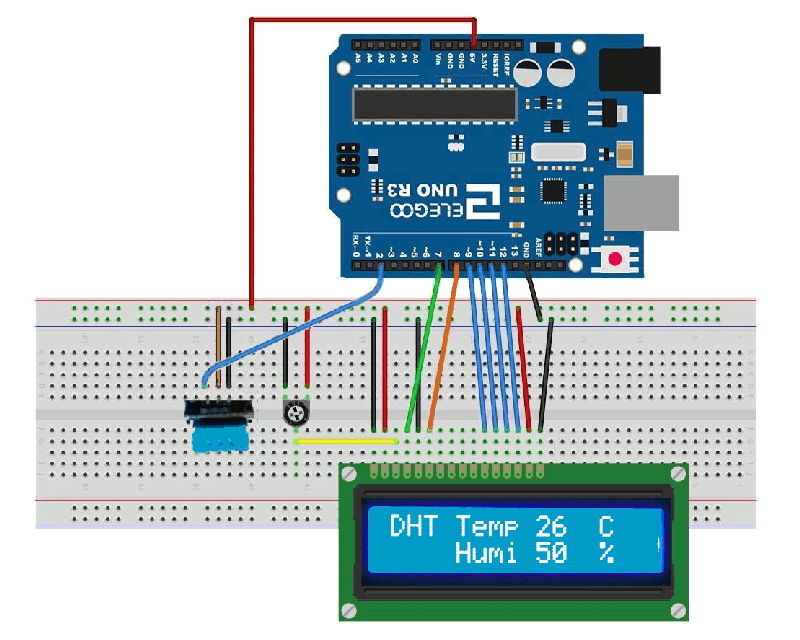

## Temperature monitor with DHT11 and LCD
It might be the simplest room temperature and humidity 

[**Schema**](./dht.gif)


## Components and supplies
 
- 1 Arduino UNO
- 1 I2C 16x2 Arduino LCD Display Module
- 1 9V to Barrel Jack Connector
- 1 DHT11 Temperature Sensor and Humidity
- Jumper wires (generic)

## Code

```
#include <LiquidCrystal.h>

int DHT_PIN = 2;   

//                BS  E  D4 D5  D6 D7
LiquidCrystal lcd(7, 8, 9, 10, 11, 12);

void setup()
{
  lcd.begin(16, 2);
  pinMode(DHT_PIN,INPUT_PULLUP);
}
  
void loop()
{
  int data[5];  

  // DHT_PIN　
  pinMode(DHT_PIN, OUTPUT);
  digitalWrite(DHT_PIN,LOW);
  delay(20);
  pinMode(DHT_PIN,INPUT_PULLUP);

  // Response
  pulseIn(DHT_PIN, HIGH, 300);

  // Byte x 5 
  for(int dataIdx=0;dataIdx<5;dataIdx++){
    data[dataIdx] = 0;
    for(int bitIdx=0;bitIdx<8;bitIdx++){
      data[dataIdx] <<= 1;
      // HIGH  50ms 
      if(pulseIn(DHT_PIN, HIGH, 300) > 50)
          data[dataIdx] += 1;
    }
  }
  // DHT11 
  lcd.setCursor(0, 0);
  lcd.print("SIS Temp     C  ");
  lcd.setCursor(9, 0);
  lcd.print(data[2]);
  // DHT11 
  lcd.setCursor(0, 1);
  lcd.print("    Humi     %  ");
  lcd.setCursor(9, 1);
  lcd.print(data[0]);

  delay(2000);
}


```


